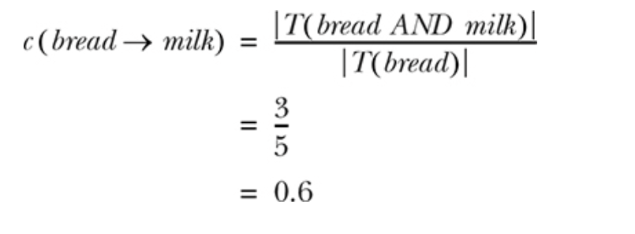
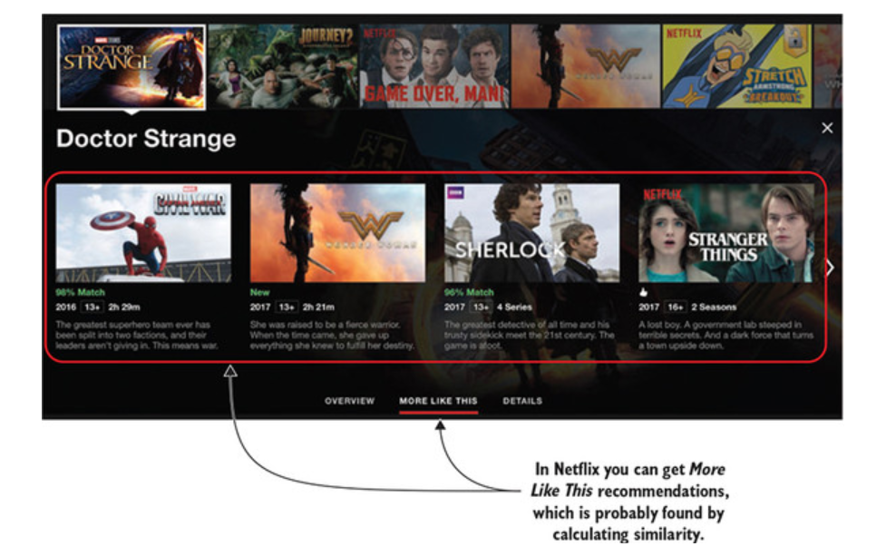
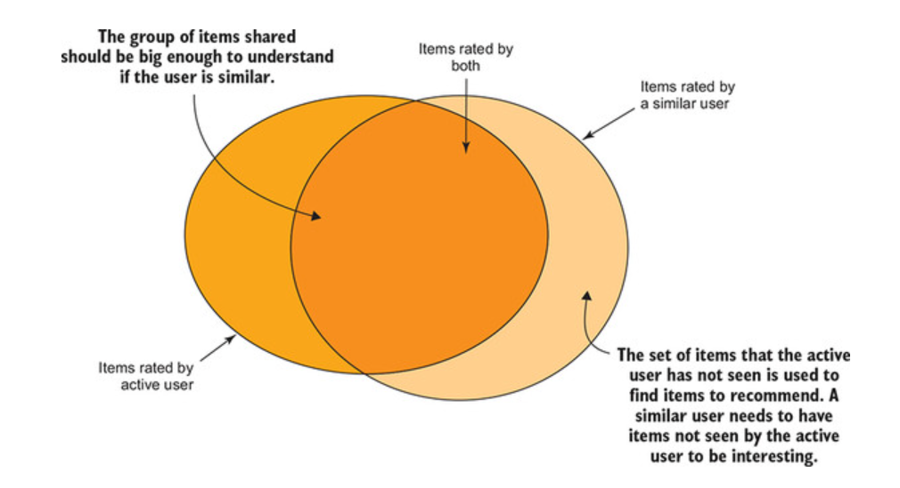
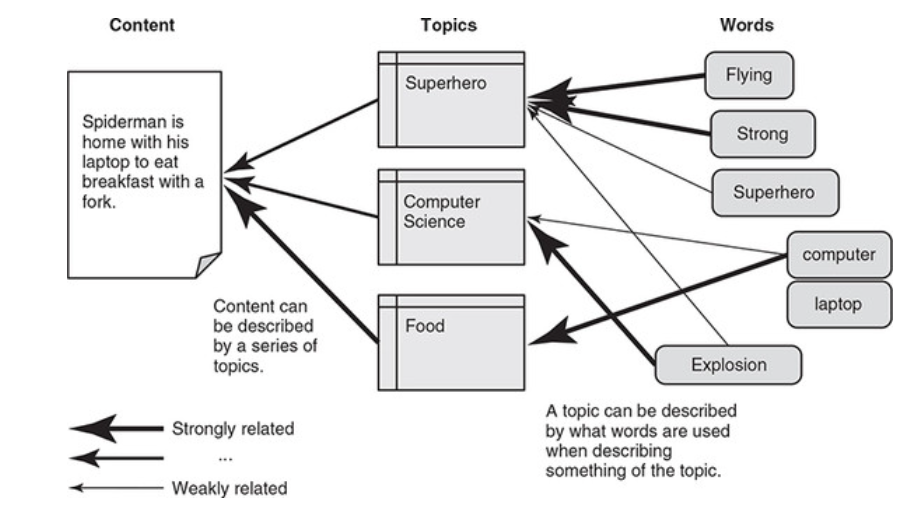
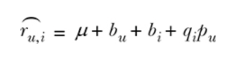

# Practical Recommender Systems

The notes on this markdown file are taken from [Practical Recommender Systems](https://www.goodreads.com/book/show/28510003-practical-recommender-systems?ac=1&from_search=true&qid=3Wyf6zSZ92&rank=1) book.

# Chapter 1. What is a recommender?

1) There are 3 types of recommendations:

    - Non-personalized: All user viewing the same recommendation. A list of most popular movies on Netflix or most sold items on Amazon can be thoguht as non-personalized RS.
    - Semi-personalized: Based on geographical info, gender, nationality, whether user is moving or not. The RS doesn't know anything special to users. It is also called as segment-based RS.
    - Personalized: Amazon's for you is an example of personalized RS.

2) A watchlist/liked list on Netflix can be useful. It indicates interest.

3) Netflix recommendation algorithm takes time into consideration. The recommendations on mornings differ the recommendations on evenings.

4) Different terms on recommendations


5) How top picks work on Netflix


6) The rating prediction is only a part of RS(Recommendation Systems) but it is the most important one.

7) Dimensions to describe a RS

- Domain: "The domain is significant because it provides hints on what you’d do with the recommendations". The domain is determining whether RS should give recommendations more than once or not .

- Purpose: Measuring something different instead of our direct gal is considered as proxy goal. Netflix considers the amount of view as a deciding factor in order to evaluate its success, which is a proxy goal. The main goal is to increase revenues. However, using a proxy goal might lead to

- Context: It is the environment in which users get recommendations. Time of the day, location of users, the weather can be considered as context.

- Personalization Level

- Whose opinions

- Privacy and Trustworthiness

- Interfaces

- Algorithms

8) "Customers who bought this also bought this" is an example of seeded recommendations. These recommendations are based on a seed, which is the current item.

9) Organic presentation is that the website locates recommendations in an organic way like Netflix's homepage. Users just view movies chosen for them. Whereas, Amazon's Just For you is a non-organic way, which is a separate page listing items on Amazon.

10) Black box recommendations vs white box recommendations


11) For RS, generally there are 3 types of algorithms.

- Collaborative Filtering: Usage data like click, conversion and impression is used 

- Content Based Filtering: Content metadata and user profile used.

- Hybrid Recommenders: Mix of above two solutions.

12) MovieGeeks Architecture and main page layout


13) A baseline recommender system is to return popular items.

# Chapter 2: User behavior and how to collect it

1) 2 types of feedbacks

- Explicit: Ratings or likes

- Implicit: "Activity recorded by monitoring the user"

2) The purposes of RS might be different

- Amazon's purpose is to make people buy more

- GAP's purpose is to make you like and not cause you to return it

- Mofibo's(An online reader platform) purpose is let you open less books as much as possible.

- Netflix's purpose is to make you watch more films, especially their own products.

3) Event Lists on Netflix. An evidence collector is used to collect data like below.


4) A pageview can mean that the user is interested or it is lost in the website.

5) Page Duration on a page can mean different things like below.


6) Expansion linkes can refer to an interest.


7) Sharing on Social Media can be attributed to interest of an item.


8) Add to playlist, favorite list, watchlist indicates an interest.

9) Evidence collector(like xenn) should be a different app than our main app.

10) An example data model of event collector


11) The following data model is useful and flexible.


12) The following data model is a standard model.


# Chapter 3: Monitoring the system

1) We have to integrate an analytics app to measure the effect of RS.

2) We can't build a RS with an analytics dashboard to keep an eye on things.

3) Number of visitors, conversion rates, number of items sold are some important KPI's.

4) A conversion funnel of Amazon


5) An analytics dashboard example


6) "Having a dashboard that shows you how your site is doing will be a great help when doing recommender systems".

# Chapter 4: Ratings and how to calculate them

1) General pipeline of a RS


2) Having read the previous chapters, you should have considered the following:

- What’s the purpose of your site (the goals that you want users to achieve)?

- What events lead up to these goals?

- How many times has each of these events happened?

3) User-Item matrix can be thought as a dataset whose rows correspond to users and columns correspond to items.


4) An explicit matrix can be plotted on the matrix.

5) Amazon uses item-to-item recommendation algorithm because it has more than 200 million users. You can access to its details via [this link](https://www.cs.umd.edu/~samir/498/Amazon-Recommendations.pdf).

6) Other websites can use browsing history of their users.

7) An example of "Recommended For You" of New York Times


8) Relevance should be taken into consideration in order to implement a RS.

9) Linkedin's "People You Know" and Facebook's "Friends Suggestion" are 2 RS based on implicit rating.

10) In e-commerce, rating happens after buying. This makes things complicated.

11) Time should be taken into consideration. More importance should be given to recent transactions/items.


12) Several events like conversion, click, viewing details etc. needs to be combined to constitute a user-item matrix.

13) In order to assign different weights to different events(details, moreDetails, genreView etc here), their impact on conversion should be taken into account.

`IRi,u = (w1 × #event1) + (w2 × #event2) + ... + (wn × #eventn)`


14) A music streaming platform like Spotify might give more importance to recent activities.

15) "The thinking is that if a user buys an item that’s popular, it doesn’t provide much information about the user’s taste. If the same user likes something only few people like, then it could be a better indication of the personal taste of the consumer".

16) Assigning more weights to less frequent items could boost our RS.


# Chapter 5: Non-personalized recommendations

1) Coupon.com's non-personalized RS on mainpage. It recommends

2) A simple RS is to order what people are most likely to favor. This might be price-oriented, recency-oriented. 

3) Top 10 Food Restaurants on a meal website is a non-personalized RS. It was used in the past a lot.

4) A RS has 2 components: builder(training) and serving(inference).

5) A RS can be either memory-based or model based. Memory based RS can be challenging.

6) Some websites have a fallback recommender in case of safety mechanism besides their main RS.

7) It is a good practice to separate RS from the main app.

8) Frequently Bought Together(FBT) is an example of seeded recommendations. "People who viewed this item also viewed these" is also seeded recommendation.

9) FBT might not work well frequently. In addition to a rare item in a cart, there might be a popular item in a cart. Thus, popular item will be promoted irrespective of the content of the cart. This is challenging for FBT. Most people are buying milk from the supermarket. FBT will result in a boost in the recommendation of Milk.


10) Association rules in FBT


11) For a transaction like below, In order to find association rules, we should find frequency sets. Association rules work with explicit ratings(buys etc) better than implicit ratings(clicks).


- Confidence: 




- Support:


12) A new type of recommendation: "What other items do customers buy after viewing this item?"


13) "Online Consumer Behavior"  by Angeline G. is a book focusing on how users behave on the internet.

# Chapter 6: The user (and content) who came in from the cold

1) Cold start problem exists not only for new users but also for new items.

2) Some common connections if a user liked movie #1 in order to recommend movie #2


3) A solution to cold start problem by Netflix for new items.


4) Scientific papers state that personalized recommendations can't be calculated before a user rates 20 to 50 items.

5) Amazon's "What other people are looking" is a recommendation method.

6) Gray sheep can be considered as a unique user in terms of RS.

7) A solution to cold-start problem is direct users to log in with Google and Facebook accounts.

8) Sometimes, it is better to implement a business logic after recommendations. For example, RS in online movie market output a list of recommendation. The focus movie is a horror film and the recommendation is partially composing of sci-fi movies. It is better to drop sci-fi movies from the list.


9) Demographic Recommendations is to recommend content popular with that segment. It is an implementation of  semi-personalized RS.

10) Some obvious segments 

- Age

- Gender

- Location

11) Some not-so-obvious segments

- German women who browse in the evening during the weekend and like action

- American male teenagers who buy horror films during school time

12) A handy method to deal with cold start and sparsity in data is to abstract item into its category.


13) Improve your recommendations section by Amazon. It is implemented for logged-in users, not for anonymous users.


14) "Active learning for recommender systems is about creating an algorithm that comes up with good examples for the user to rate, which then provides the recommender with valuable information about the person’s preferences.".

15) Association rules can be used in personalized recommendations too. It is an easy and quick way to add personalization.

16) Viewing a single item is sufficient to show "recommended for you" RS.

# Chapter 7: Finding similarities among users and among content

1) Clustering can halep in collaborative filtering.

2) Netflix's More Like This rs



3) Similarity can be calculated among content and among users using different metrics.

4) In the literature, few similarity functions are outputing good results.

5) Similarity functions affect similarity scores


6) Different types of data: Unary data, Binary data, Quantitative data


7) Jaccard Similarity between 2 items on a user-item matrix


8) A simple Similarity score for one movie rating between 2 users. 


9) This can be called as L1-norm, manhattan distance or taxicab geometry. We just take absolute difference between 2 data points.


10) L2-norm known as Euclidean norm


11) Cosine similarity between 3 persons among 2 movies.


12) Amazon uses item to item collaborative filtering because the number of users is much more than the number of items on Amazon.

13) Vanilla cosine similarity


14) Adjusted cosine similarity, which is normalized by average rating of user. It ranges from -1 to +1.


15) Pearson correlation, which ranges from -1 to +1.


16) Pearson correlation and adjusted cosine similarity are so close terms to each other. Adjusted cosine similarity takes items rated by either or both users, whereas pearson correlation takes items rated by only both users.

17) We have to use clustering in order to compute user-user similarity efficiently.

18) It is difficult to make Kmeans Clustering work correctly.

19) User collaborative filtering Venn Diagram.



20) [Grouplens](https://grouplens.org/) is a research group in University of Minnesota.

21) It is a good practice to filter 20-50 users in order to compute similarity metric(pearson correlation or cosine similarity or adjusted cosine similarity) rather than whole data.

22) It is a good way to double check clustering with pearson correlation. The points in the same cluster should have a high pearson correlation pairly.

# Chapter 8: Collaborative filtering in the neighborhood

1) Collaborative Filtering(CF) is an umbrealla of methods. It also covers neighbor-based filtering. CF uses only ratings(explicit or implicity) as recommendation engines, which means no metadata is used. CF is content-agnostic.

2) Amazon's "Recommended For You" is based on CF.

3) Neighbor based filtering can be handled in 2 ways:

- User based Filtering

- Item based Filtering


4) User based CF pipeline


5) Item based CF Pipeline


6) If you want to calculate as few similarities as possible and you have much more users than items, you should prefer item-based filtering.

7) In terms of serendipity, user-based filtering sounds more reasonable.

8) In terms of explainibility, item-based filtering sounds more reasonable because it is easy to state that you may like this because you bought that etc. Whereas, user-based filtering is hard to explain while preserving privacy.

9) "A way to implement collaborative filtering is by first finding all the items that are rated by several users (more than two users at least)"

10) User who have rated only 1 or 2 items shouldn't be taken into consideration for CF. Users who rated lots of items may lead to too generalized recommendations.

11) Clustering might be used to narrow down the search space.

12) How to approach the similarity scores: Threshold or Top-N. Both have pros and cons.


13) Classification way and regression way for rating


14) Some of candidate items are recommended, this is based on finding item similarities and then computing ratings for each candidate.


15) How to compute the rating of a possible item for a user. Normalized user ratings must be used.


16) In order to get the prediction rating of an item for a user, all possible candidates must be rated thanks to similarity scores. After calculating ratings, return top 10.

17) Some ways to overcome cold start problems:

- Let users rate a few items

- Create a new arrivals list

18) Another way to deal with cold start problem is exploit/explore strategy.


19) Online and offline serving


20) [`coo_matrix`](https://docs.scipy.org/doc/scipy/reference/generated/scipy.sparse.coo_matrix.html) is a way to build a user-item matrix.


21) How rating is calculated after calculating similarities.


22) Some considerations while implementing CF


23) Some drawbacks of CF

- Sparsity

- Gray Sheep

- Number of Ratings: We need many ratings to have a good CF model.

- Similarity: CF follows users' behavioral trends. CF tends to put most popular items into recommendations often.

# Chapter 9. Evaluating and testing your recommender

1) Most people believe that evaluating recommendation engines is hard without a live system.

2) Evaluation cycle of a RecSys


3) Starting with the simplest algorithm and then improving it is a recommended way.

4) The followings are expected from a RS.

- Understanding my taste: This can be measured by how often the recommender gets close to predicting the correct rating.

- Diversity: [Improving Recommendation Diversity](https://www.academia.edu/2655896/Improving_recommendation_diversity) is an article on diversity. It means recommending more than popular items.

- Coverage: A metric to measure how many percentage of users have recommendations & how many percentage of items are recommended. User catalogue and Item catalogue are different. 13% item coverage is regarded as bad.

- Serendipity: [A paper on Serendipity](https://citeseerx.ist.psu.edu/viewdoc/download?doi=10.1.1.464.8494&rep=rep1&type=pdf). Serendipity means surprising users with recommendations.

5) 3 types of evaluation. RS researchers believe that offline experiments not working, controlled user experiments and online experiments are too expensive.

- Offline:


- Controlled user experiments:

- Online Experiments:


6) [Rethinking the Recommender Research Ecosystem: Reproducibility, Openness, and LensKit](https://files.grouplens.org/papers/p133-ekstrand.pdf) is a paper focusing on recommendation research ecosystem.

7) There are 2 ways of measuring offline experiments.

- Measuring error metrics: MAE, RMSE etc. "The difference between the ratings in your historical data set with what the recommender algorithm outputs"

- Measuring decision-support metrics: Decision support is about taking each element and asking if the system was right or wrong

8) For a RS, one of 4 scenarios exists for an item.


- True Positive(TP): It is recommended and it is consumed
- False Positive(FP): It is recommended but it is not consumed.
- False Negative(FN): It isn't recommended but it is consumed.
- True Negative(TN): It isn't recommended and it is not consumed.


9) Precision and Recall Calculation


10) Precision @k is a decision-support metric. "The k top elements are measured by taking the number of relevant items between the first k items". Precision at k isn't sufficient because it doesn't cover ranking, first recommended item has the same effect as last recommended item.


11) Mean Average Precision is a modified version of Precision @k. The below formula shows one calculation for one item. For all items, average it as in the second image below.


12) NDCG(Normalized Discounted Cumulative Gain) is another metric. It takes care of relevance, which requires rating data rather than binary data. IDCG is Ideal Discounted Cumulative Gain. NDCG is between 0 and 1.


13) In e-commerce, a user is expected to have 20 ratings in the website. This 20 threshold might be too high. It may be necessary to fine-tune it. It decreases the number of users taking recommendations from 50k to less than 10k if 20 threshold is applied.

14) Splitting data into train, valid and test can be made based on user(favorable), random(problematic) or time based(most favorable).


15) Time based splitting


16) User based splitting


17) K-fold cross validation


18) Evaluation Pipeline


19) 1 out of 50, which is 0.02, might be considered as a good starting point for a recommendation engine.

20) A new RS should be benchmarked against the following baselines:

- Predict score: Items whose average rate are higher to be recommended as baseline

- Top N: Most rated items to be recommended as baseline.

21) Online evaluation can be carried out in the following ways

- Controlled Experiments

- Family and Friends

- A/B testing


22) Exploit/explore strategy is used in Yahoo news.

23) [Some slides](https://www.slideshare.net/justinbasilico/deja-vu-the-importance-of-time-and-causality-in-recommender-systems) on Netflix's RS

24) "Whenusers accept these recommendations it creates a feedback loop in the recommender system, and these loops iteratively influence the collaborative filtering algorithm’s predictions over time". A [paper](https://proceedings.neurips.cc/paper_files/paper/2016/file/962e56a8a0b0420d87272a682bfd1e53-Paper.pdf) on this topic. Somehow, new contents should be introduced to this loop.


# Content-Based Filtering

1) An example pipeline for CBF(Content Based Filtering). When item data is known and user data isn't known mostly, CBF is the way to go.


2) CBF Training and Inference respectively


3) Metadata of an item can be regarded in 2 ways.

- Facts: Non-changing realities. Example: Production year.

- Tags: Interpreted. Example: Breaking the fourth wall.

4) News articles are relevant for a short time. Thus, using CF doesn't make sense so much.

5) In order to build a Bag Of Words(BOW) model, it is advised to remove stopwords.

6) It is a good practice to remove high-frequency words due to noise introduced and low-frequency words due to complexity introduced.

7) Stemmer or Lemmatizer should be used to find the base of the word. "Better" turns to "good" in lemmatizer and "better" remains "better" in stemmer.

8) Latent Dirichlet allocation(LDA) is much more preferrable over TF-IDF.

9) LDA and Word2vec models are usually used for different things.

10) LDA decomposition


11) LDA example



12) LDA takes a document and represents it as a combination of different topics. Each topic has different words.


13) The media company [Issuu](https://issuu.com), for example, uses an LDA model to offer recommendations.

14) Finding an optimal K (number of topics) is hard. Lower K means too many documents will look like each other. If K is too big, it is hard to find a similar document. [pyLDAvis](https://pyldavis.readthedocs.io/en/latest/readme.html) is a library to visualize LDA results.

15) Alpha an Beta are 2 parameters for LDA. The bigger the alpha, the more topics a document is assigned. The more the beta, the more words assigned to a topic. Be careful when tuning alpha and beta.

16) After obtaining LDA model, "You can calculate their similarity. Because the probability distribution can be seen as vectors, many use cosine similarity for their calculations".

17) In terms of cold start problem, CBF is better.

18) A user who rated La La Land as 3 points and Raiders of the Lost Ark as 5 points. His user profile is created by multiplying the base vectors with ratings. Then this summation is normalized(not included in the image)


19) MAP(Mean Average Precison) is the metric CBF can use.

20) The performance of CBF is worse than CF on moviegeeks data. This is probably due to the nature of the problem, which is composed of user ratings.

21) The coverage of CBF, which is being able to recommend items for items, is higher than CF.

22) "Evaluating content-based recommenders can be done by dividing each user’s ratings into training and testing data (as you learned in chapter 9). Then run through each user and calculate the recommendations to see if it produced something that was in the test set".

23) CBF isn't good for serendipity.

# Chapter 11: Finding hidden genres with matrix factorization

1) We will explore latent factors.

2) Simon Funk's solution on Netflix Competition became popular. Click [here](https://sifter.org/~simon/journal/20061211.html) for more information.

3) In order to work with rating matrix, behavioral data or implicit ratings should be converted into ratings.

4) In SVD, it is easy to add new users but terribly slow to calculate SVD if you have a larger dataset.

5) "The basic idea is that by looking at the behavioral data of users, you can find categories or topics that let you explain users’ tastes with much less granularity than with each movie but more detail than genres"

6) An illustration of SVD on 2-dimensions. Second dimension(y) is about being serious but first dimension(x) is unassigned.


7) Dimensionality Reduction rarely works. Use a vector space as a box that you ask about similarity among users and items.

8) Filling the matrix with 0 isn't the best option.

9) Matrix multiplication illustrated


10) Factorization is splitting thing up.

11) UV Decomposition. U is user matrix with the shape of (n,d) and V is item matrix with the shape of (d,m). We need to insert reasonable values into U and V matrices in order to be as close as possible to R.


12) SVD is another decomposition technique. It uses 3 matrices instead of 2. Σ is a diagonal matrice in the shape of mxm or nxn. The diagonals are sorted decreasingly. The value in a diagonal shows importance in the decompositon. If there are 5 values in a Σ matrix and the diagonals are [20,10,8,7,5], the diagonals covering at least 90 percent of the summation should be selected orderly, which is [20,10,8,7]. That means that 5th dimension is ignored. In the below example, 4 out of 6 dimensions are considered as important.


13) Σ can be fed into U and Vt by multiplying U with square root of Σ and multiplying Vt with square root of Σ. Hereby, Σ's shape is reduced to k(4) and the number of matrices(U, Σ, Vt) are reduced to 2(U, Vt). After obtaining U and Vt, we can calculate the rating of a user for an item.

```python
def rank_k2(k):                                           
    U_reduced= np.mat(U[:,:k])
    Vt_reduced = np.mat(Vt[:k,:])
    Sigma_reduced = Sigma_reduced = np.eye(k)*Sigma[:k]
    Sigma_sqrt = np.sqrt(Sigma_reduced)                   
    return U_reduced*Sigma_sqrt, Sigma_sqrt*Vt_reduced

U_reduced, Vt_reduced = rank_k2(4)                        

M_hat = U_reduced * Vt_reduced  
```


14) User-item matrix is a sparse matrix whose density is lower than 1 percent. Thus, empty values should be handled. 2 ways to handle are below.

- Imputation with the mean of user or item
- Normalizing each rows, all rows are centered around 0. The zeros will become the average.

15) We know Σ and Vt. If a user has some ratings, We can insert it into M matrice and deduce his profile via the formula.


16) How to calculate the hidden representation a new item if it was rated by some users


17) "It’s important to update the SVD as often as possible. Depending on how many new users and items you have, you should do it once a day or once a week"

18) How to provide recommendations with SVD

- Calculate all predicted ratings and take the largest ones that the user didn't see before

- Iterate through each item and find similar products in the reduced space

- Calculate neighborhood CF on M thanks to its dense content. Find similar users or similar items.

19) Some cons of SVD

- Requiring an imputation approach for empty cells

- Slow

- SVD is static, therefore it is required to update as often as possible.

- Not explainable

20) Some pros of SVD

- It is easy to handle new users and items

21) [Application of Dimensionality Reduction in Recommender System](https://files.grouplens.org/papers/webKDD00.pdf) is a paper suggested by the author.

22) Baseline prediction for a user-item pair


23) The way to compute global bias,user bias and item bias

- Calculate global mean

- Calculate user bias

- Calculate item bias

- Fill empty values on user-item matrix with global mean, user bias and item bias


```python
global_mean = M[M>0].mean().mean()                               
M_minus_mean = M[M>0]-global_mean                                
user_bias = M_minus_mean.T.mean()                                
item_bias = M_minus_mean.apply(lambda r: r - user_bias).mean()
```

24) An example of calculated user bias and item bias


25) If all goals are avhieved, it might to okey to add time aspect to bias formula


26) Funk SVD is also named as regularized SVD and it is an alternative to SVD. Instead of using whole matrix, it uses only things we need to know. It uses gradient descent to constitute U an Vt matrices. In Funk SVD, we don't have Sigma matrix(Σ). Before starting calculations, it is required to decide the hidden vector size.

27) It is required to shuffle list of ratings because trends in ratings may result in absurdities in the optimization process.

28) A predicted rating is a combination of these four things


29) Simon Funk's hyperparameters are 0.001 as learning rate, 0.02 as regularization and 40 as hidden vector for factorization in the Netflix Prize competition.

30) 150 iterations can be used as number of iterations.

31) After obtaining User Factor Matrix, Item Factor Matrix, Item Bias and User bias,  the followings are the ways to offer recommendations

- Brute Force: Recommend possibly most-ranking predictions according to the formula below



- Neighborhood Recommendation Calculation: Offer recommendations from the cluster you defined.

- User vector: Finding items whose factor vectors are close to active user's vector. However, user's factor vector is a sum of the items he like. For instance, a user might like American Westerns and Polish Drama movies. The user will be located at the point between American Wsterns and Polish dramas, which might be close to Irish comedies that the user probably doesn't like.


- Finding items closer to items that user likes

- Finding favorable tems of users that the active user is close to.


32) It is necessary to keep the model up-to-date daily or weekly.

33) Alternating least squares can be used instead of gradient descent.

34) [implicit](https://github.com/benfred/implicit) is a python library focusing on implicit data usage in RS.

35) When Funk SVD is implemented on movielens data, its user coverage is 100% and its item coverage is 11%. Funk SVD outperformed CBF but Neighborgood CF outperformed Funk SVD.

36) Regularization keeps latent vectors close to 0.

37) Item bias and user bias should be scaled. For movielens dataset, the ratings range from 1 to 10. The average rating is 7, item bias and user bias shouldn't be too much above 1.5.


