# PyData-Notes
Notes that I took on PyData Youtube Videos

### Video 1 - Sktime

[Video Link](https://www.youtube.com/watch?v=Wf2naBHRo8Q&ab_channel=PyData)

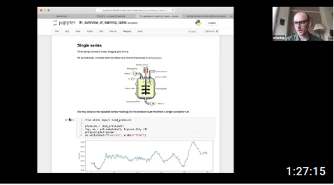


1) Some time series libraries + sktime are below.

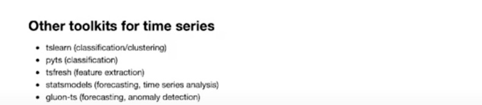

2) Tabularization can be visualized as follows:

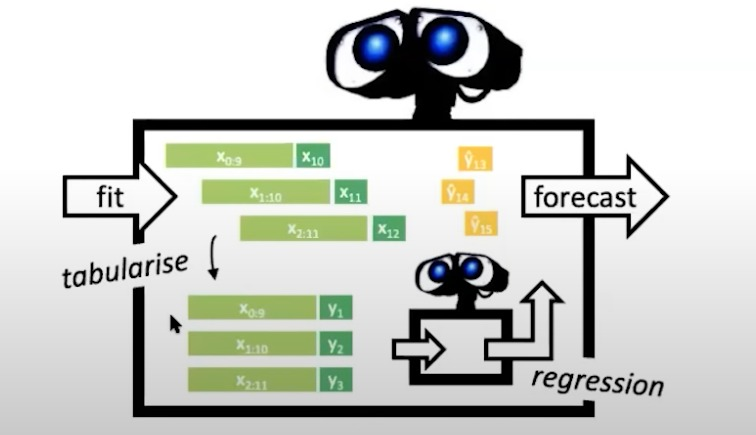

### Video 2 - How to quickly build Data Pipelines for Data Scientists 


[Video Link](https://www.youtube.com/watch?v=XMnDCZhm9Go)


1) Some advices on data pipelining

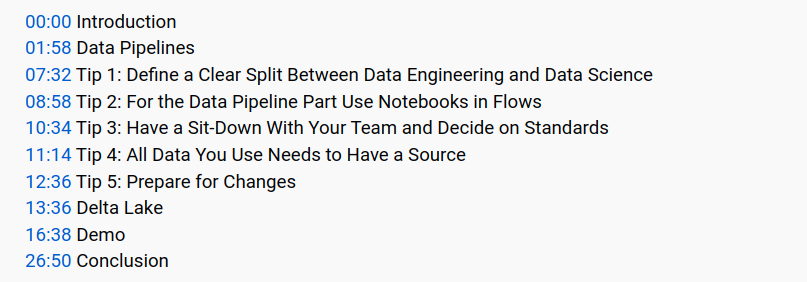

2) Parquet is a data format mostly used in cloud environment. It is easily convertable to csv's.


### Video 3 - Data Exploration Tools


[Video Link](https://www.youtube.com/watch?v=tiNQDY8ixXU)

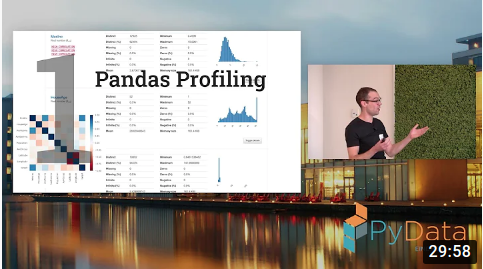


1) Data Exploration Tools

* Open Source

    1) Pandas Profiling, Most famous 
    2) SweetVIZ, Target vs Input, creates HTML
    3) DABL, not developed anymore 
    4) dTreeViz , innovative to split data
    5) dtale, an interactive tool

* Commercial

    6) Trifacta
    7) SPSS

### Video 4 - Pandas Time Series Codes


[Video Link](https://www.youtube.com/watch?v=8upGdZMlkYM)

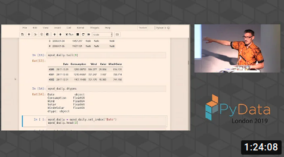

1) pd.date_range can be used to create datetime array(list with particular intervals)

```
# Daily date objects created and put in datetime_array. 366 elements in itself. Inclusive end.
import pandas as pd
datetime_array = pd.date_range(start ='1-1-2019',end ='1-1-2020', freq ='1D')
print(len(datetime_array))
```

2) Pandas `loc` attribute of dataframes or datetimes has a property of inclusive end. In python, end boundary are exclusive(for example: `range(0,10,1)`)

3) While plotting a line plot in matplotlib, reduce the size of dots via **linewidth** property

```
import pandas as pd
a = pd.Series([1,2,3])
a.plot(linewidth=0.5)
```

4) Seaborn boxplot is superior to matplotlib boxplot. It enables us to visualize grouped boxplots.

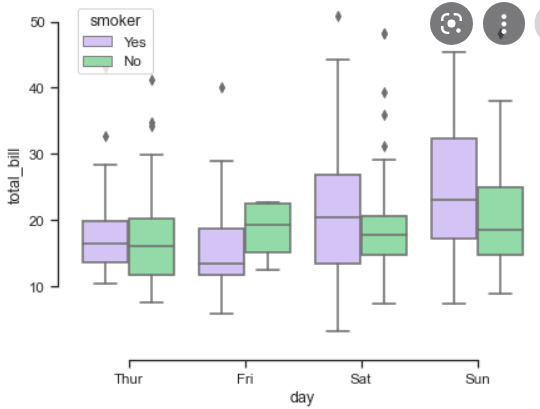


5) A one dimensional time series data can be checked to have autocorrelation via autocorrelation_plot function.

```
import pandas as pd; import numpy as np
from pandas.profiling import autocorrelation_plot

a = pd.Series([1,2,3,4,1,1,1,1])

autocorrelation_plot(a)
```

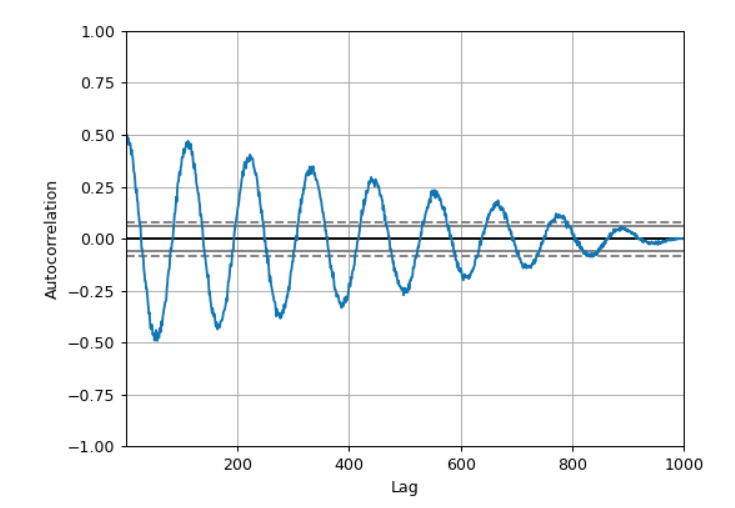

6) To fill absent values in a time series dataframe, under the condition that index is consisting of datetimes, use **asfreq** method([link](https://pandas.pydata.org/docs/reference/api/pandas.DataFrame.asfreq.html)).

7) Rolling mean of pandas react faster than weekly mean resample. If a bump and dump occurs in data consecutively, weekly mean resample neutralizes it but rolling mean was affected much more.

### Video 5 - Vincent D. Warmerdam: Untitled12.ipynb

[Video Link](https://www.youtube.com/watch?v=yXGCKqo5cEY)

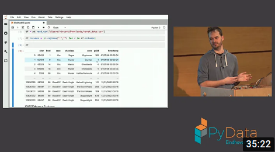

1) Contextual help is a property of Jupyter lab, which splits the screen by two. It is showing us the definitions of methods when cursur is on top of the method.

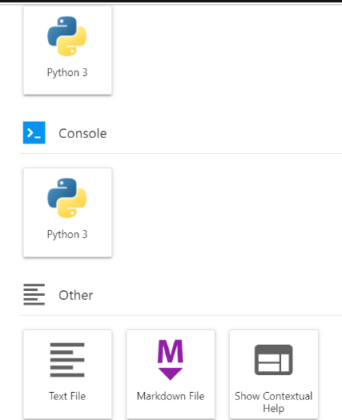

2) Pandas group by can be used with `agg` method. In agg method, use kwargs(keyword arguments) that the key is the name of value we want to calculate. The value is a tuple consisting of 2 elements. First element is showing us on which column to apply aggregation and the second element is what aggregation to apply.

```
df = pd.DataFrame({
    'letter':['a','a','b','b','b','c','c'],
    'value': [1 ,5, 13, 12, 8, 3, 3 ]
})

df.groupby('letter').agg(
    unique_count = ('value','nunique'),
    mean_value = ('value',np.mean),
    max_value = ('value', max)
)

#         unique_count  mean_value  max_value
# letter                                     
# a                  2           3          5
# b                  3          11         13
# c                  1           3          3

```

3) pd.DataFrame().pipe(function_to_call) is allowing us to deal with pipelines similar to R.

```

df = pd.DataFrame({
    'A':[1,2,3,1,2,3,3,np.nan],
    'B':[10,10,10,20,30,50,np.nan,40]
})

def dropna_data(df):
    return df.dropna()

def calculate_max(df):
    return df.max(axis=1)

df.pipe(dropna_data).pipe(calculate_max)

```

4) Decorators are similar to packaging a gift in Python. They are functions that take functions as asgument and return functions. Used for checking(by 0 division etc, shape checking) and logging etc.

```

from datetime import datetime
import time

def mydecorator(func):
    def wrapper(*args, **kwargs):
        time_start= datetime.now()
        func()
        time_end = datetime.now()
        print(f"Time elapsed = {(time_end - time_start)}")
    return wrapper

@mydecorator
def wait_3_seconds():
    time.sleep(3)

@mydecorator
def print_hello():
    print("hello world")

#Time elapsed = 0:00:03.003321
#hello world
#Time elapsed = 0:00:00.000074

```

5)  scikit-logo is a python framework aimimng to consolidate transformers(minmax, standard etc.), metrics and modules into a library that offer code quality/testing.

6) spaCy is an appealing python package in which there are sensible pipelines for NLP.

7) An example of Scikit Learn pipeline can be visualized as follows:

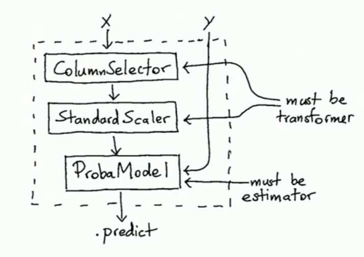


8) Pipelines are enabling us to read them from left to right and top to bottom.

* Good pipeline:

    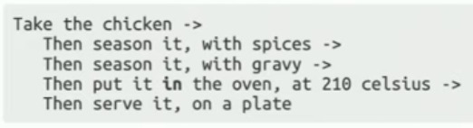

* Bad pipeline:

    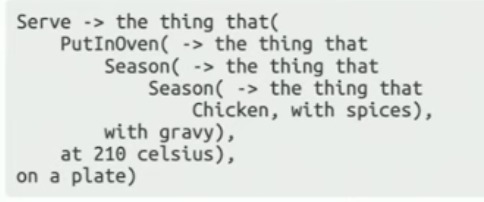

* Crazy pipeline:

    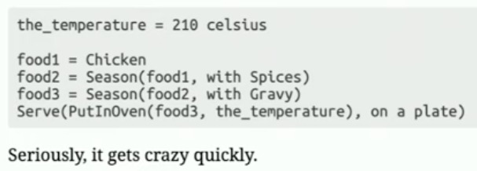

9) [drawdata.xyz](https://drawdata.xyz) is website to visualize data that we created on GUI. It is useful for comprehending the problem.


### Video 6 - Satej Khedekar: A Python application to flag outliers in very high dimensional data

[Video Link](https://www.youtube.com/watch?v=DinhTHoDRjk)


1) ASML is a python programme to flag outliers in very high dimensional data.

2) "An outlier is an observation which deviates so much from the outher observations that it was generated by a different mechanism"

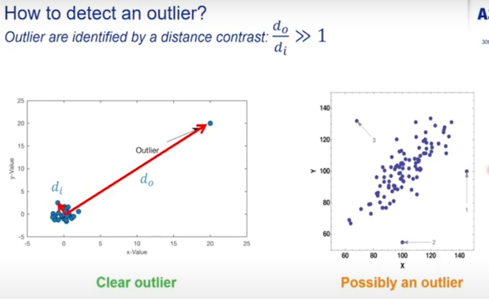

3) The curse of dimensionality means that data become increasingly sparse in the space it occupies when dimensionality increases.


4) Dimensionality reduction should be appied before performing outlier detection. Dimensionality reduction helps reduce the effect of noise which is present on high dimensional data. 5 or 10 dimensions for latent space sounds reasonable.

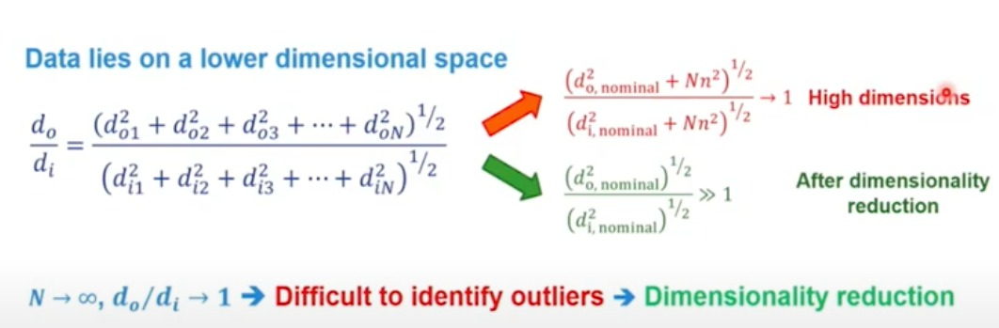

5) Principal Component Analysis and Variational AutoEncoders are 2 dimensonality techniques aiming to preserve LOCAL distances. Wheras, tSNE an UMAP are trying to preserve local distances. For outlier detection, tSNE and UMAP sounds more logical.

6) NN abbrevation in UMAP means Neastes Neighbor. NN parameter is highly important in UMAP. The more The NN, The more The global distances to be preserved.

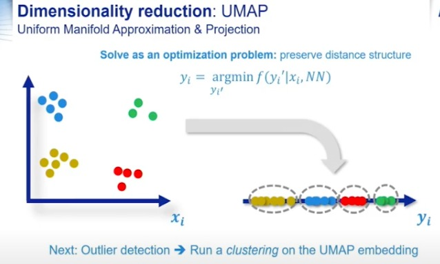

7) HDBSCAN is combining the advantages of density and hierarchical based methods. It tries to identify a dense region in the data.

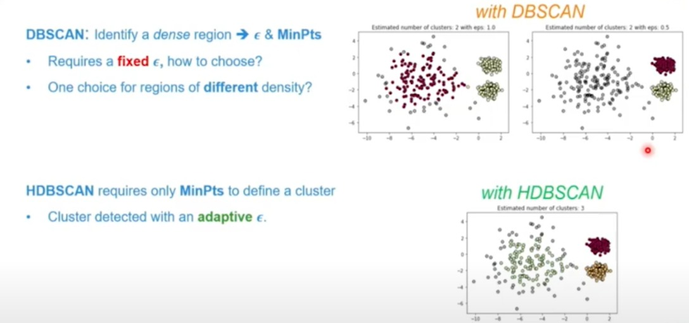

8) A summary of what happened after outlier detection

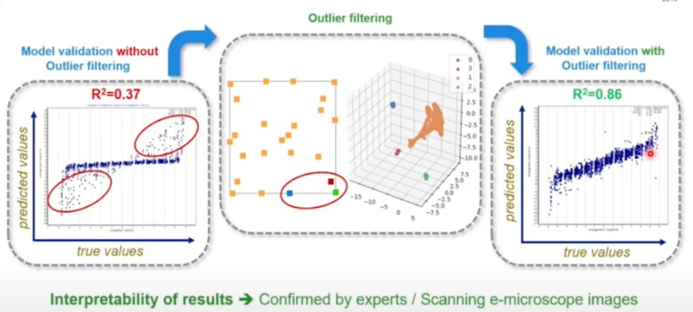

## Video 7 - Data versioning in machine learning projects - Dmitry Petrov


[Video Link](https://www.youtube.com/watch?v=BneW7jgB298)

1) Data science is different than software engineering and software engineering is different than hardware design.

2) [DVC](https://dvc.org/doc/start) is data version control and it is similar to Git of Sofware Engineering. [Official link](https://github.com/iterative/dvc)

3) A simple pipeline in dvc is as follows:

```
# -d: input
# -o: output
# command: unzip -q images.zip

dvc run -d images.zip -o images unzip -q images.zip


```

4) DVC faciliates logging, reproducing and sharing.

5) After installing DVC, it should be initialized by `dvc init` and added to git by

```
git add .dvc
git commit -m "Initialize DVC"
```

6) MLFlow is an alternative to DVC.


## Video 8 - Rob Story | Data Engineering Architecture at Simple

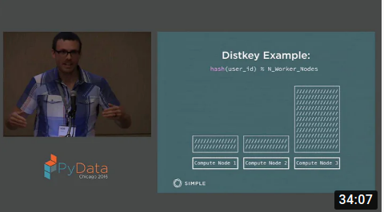

[Video Link](https://www.youtube.com/watch?v=9nX35zrN20E)

1) DWH lets us collapse 5+ DB Servers into a 1 database

2) Redshift is a DWH tool by Amazon. It is forked from postgresql.

3) Redshift can parallelize both storage and query.

4) Redshift table creation query is similar to postgresql table creation query. Except, Redshift has a distkey(distributing data based on selected column) and sortkey (sorting data based on selected column)

5) For instance, if there are 3 nodes(computers) and distkey is user_id; one of nodes may expand faster. This may result to a disk spce problem. To solve this, use distkey even while creating table.

6) In redshift, select only relevant columns from table, not to choose all columns.

7) Postgresql stores data as rowwise. Redshift stores data as columnwise.

8) Redshift has very efficient targeted data compression encoding schemes. Compression is so important for redshift. It lowers disk usage to a reasonable amount.

9) Asyncio is a concurrent programming design in Python.

10) Alembic is a table migration library.

## Video 9 - Maciej Kula | Neural Networks for Recommender Systems


[Video Link](https://www.youtube.com/watch?v=ZkBQ6YA9E40)

1) NN's are felexible in recommendation systems set up.


2) Siamese Neural Network for triplet (user, positive, negative) can be useful for ranking losses.

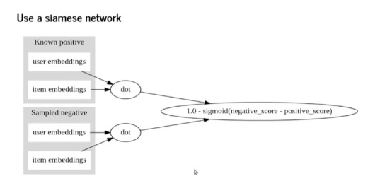

3) Instead of using all negatives, use sampled negatives which violates loss most.

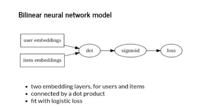

4) Recommendation may be considered as sequence prediction If a user bought a,b,c,d

| Input   | Output|
| a       | b     |
| a,b     | c     |
| a,b,c   | d     |

5) MRR, MAP, NDCG are some metrics for evaluation of recommendation systems.

6) We can fir brief sequential data to LSTM and wait it yo predict perfectly. If predictions are wrong, the architecture is wrong probably.

## Video 10 - Maciej Kula - Hybrid Recommender Systems in Python

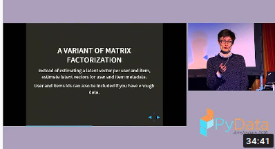

[Video Link](https://www.youtube.com/watch?v=EgE0DUrYmo8)

1) A user interaction matrix is enough to make recommendation by rowwise. Users having less distances between each other are calculated.

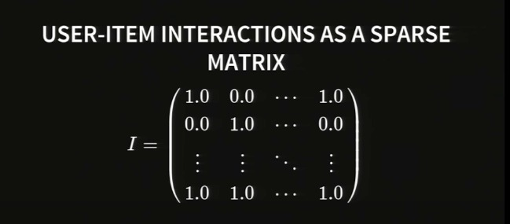

2) Matrix Factorization is a key component of Ntflix Prize Winning Example.

3) Matrix Factorization is domain agnostic and requires lots of data.

4) Some drawback of Collaborative Filtering:

- Large Product Inventory

- Short Lived Products

- Lots of new users

- Lots of new products

5) Content based filtering needs lots of data for each user.

6) LightFM is a matrix factorization library in Python.

7) Some Performanses onCross Vlidated Stat Exchange data, which user answers the questions and Metric is AUC.

- Collaborative Filtering: 0.43

- Content Based FÄ°ltering: 0.66

- LightFM: 0.71

8) LightFM is useful in problems having lots of new users and lots of new items.

9) BPR and WARP are loss functions in recommendation systems.

10) Recommenders either attemp to predict a rating of an item by a user, or generate a ranked list of recommended items per user.

## Video 11 - Hands on - Build a Recommender system: Camille Couturier 

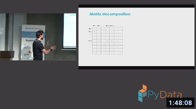

[Video Link](https://www.youtube.com/watch?v=juU7m9rOAqo)

1) COntent based recommendation systems are mostly unsupervised. THey are either cluster based or bbeighbor based.

2) SVD is a matrix factorization technique used in recommendation systems.

3) pd.DataFrame().pivot() is a way to reshape data based on indexes and columns.

4) We can import svds via `from scipy.sparse.linalg import svds`

5) SVD isn't scalable and filling nulls with 0 isn't sensible.

6) WE can approximate SVD using gradient descent with existing data and and without filling nulls.

R = P.Qt

7) Surprise is a python library used for recommendation

8) Content based RS is lacking over specification and surprise factor. A person watching GodFather 1 and GodFather 2 may not like GodFather 3.

9) CF has 2 categories:

- Model based: where 2 low ranked latent representations obtained

- Memory based: Heuristic approaches not learning parameters like above but computing similarities based on items or users.

10) Mostly offline metrics are used in evaluation of RS's. Clicks are implicit feedbacks.

11) SOme baselines in RS's are memory based CF's and popularity based metrics.

12) F1, Precision, Recall, MRR, MAP, NDCG are some metrics used in recommendation engines.

13) Cold start problem is one of the most important challenges in RS's. It is more common in CF methods.

14) Memory based CF isn't scalable, which means its computation procedure is costly.

15) 2 categories of Content based approach:

- Item based Content Based: User Features used to predict like, a different model for each item, less personalized and more robust

- User based Content based: Item features used to predict like, a different model for each item, less robust and more personalized

16) Model based CF assume a latent model for both user and item spaces. In content based filtering, these spaces are defined by humans(user features on item centered CB, item features on user centered CB)

17) User Features and item features can be concatenated to train a NN.

## Video 12 - Embeddings! Embeddings everywhere! Maciej Arciuch, Karol Grzegorczyk


[Video Link](https://www.youtube.com/watch?v=muXTMnfPU0k)

1) Faiss is a python library to find nearest neigbors of a query item. It finds the centroids of the clusters first. Then find the closest centroids to a query centroid. Then, find the neigbors of a query item among the closest clusters.

2) Reranking can be applied after finding the nearest neigbors. It improves the results. A pairwise ranking algorithm named LambdaMart improves the ranking.

3) 33 different places exist in Allegro(a popular e-commerce website) to locate recommendations such as product detail, listing, mainpage.

4) It is a good practice to put similar produts on product detail page. It is a good practice to put complementary product on cart page and after-buy emails.

5) The training procedue for recommendations of product detail and cart detail differ because our purposes on these pages are different.

6) When a new product is created in the website, the existing popular products are used to find the closes popular items to the new product. After finding the popular product, its precomputed similar products are shown on the product detail page of the new product.

6) Item to item recommendations are used in product detail page. Item to use recommendations are used for emails and main page.

7) Different approaches and pros and cons of each of user-item recommendations. The chosen approach is 3.

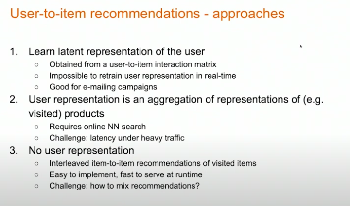

8) [Hyperparameters matter](https://arxiv.org/abs/1804.04212) is an important paper to tune hyperparameters.

9) The distribution of sales is having a long tail. Thus, most of the offers(a product can be offered by multiple sellers) aren't even sold. This complicates things and introduces noise. Thus, less-sold products are merged to a single product according to title, category etc. This led to a denser interaction matrix.

## Video 13 - Fletcher Riehl: Using Embedding Layers to Manage High Cardinality Categorical Data | PyData LA 2019

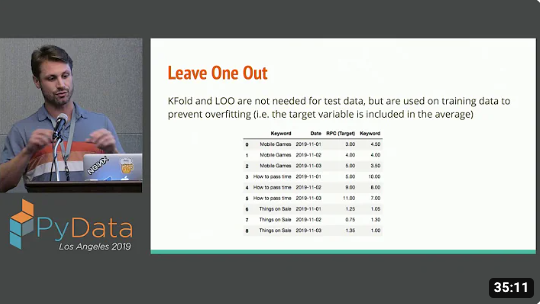

[Video Link](https://www.youtube.com/watch?v=icmjDyNaj2E)

1) Interpretability and Explainability are 2 different terms. When things get complex, interpretability is sacrificed to fulfil performance.

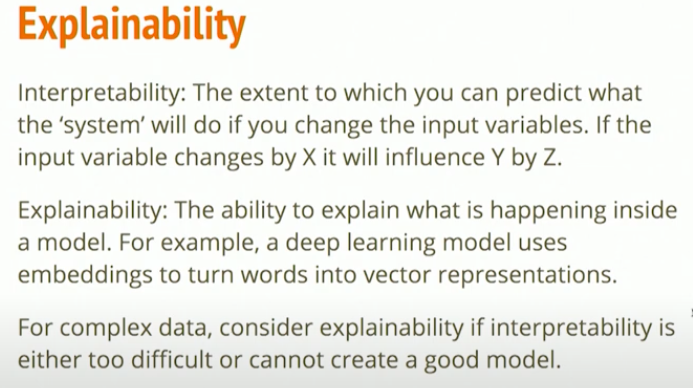

2) Some features to be extracted from a date object


3) Various techniques for target encoding

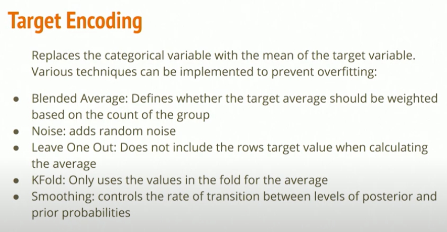

## Video 14 - Fletcher Riehl: Using Embedding Layers to Manage High Cardinality Categorical Data | PyData LA 2019

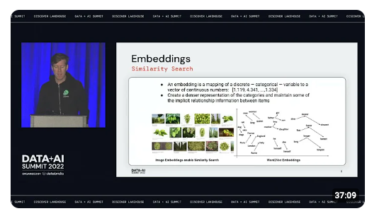

[Video Link](https://www.youtube.com/watch?v=9vBRjGgdyTY)

1) Spotify weekly is a batch operation. It brings musics to our main page or mail box. Spotify uses Cassandra.

2) From BI to AI. Tiktok is on of the best companies that leverages personalization.

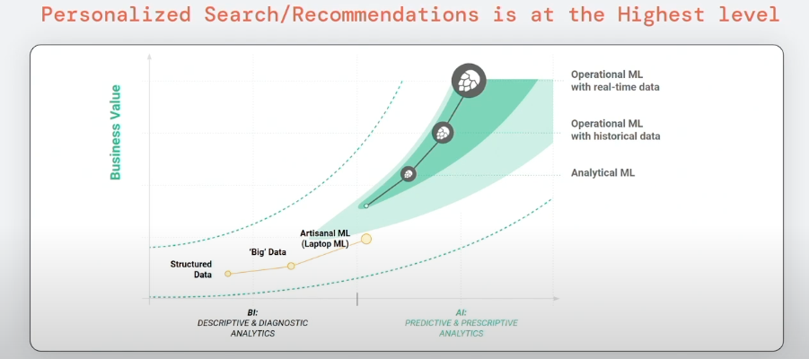

3) Hopsworks is a python centric feature store.

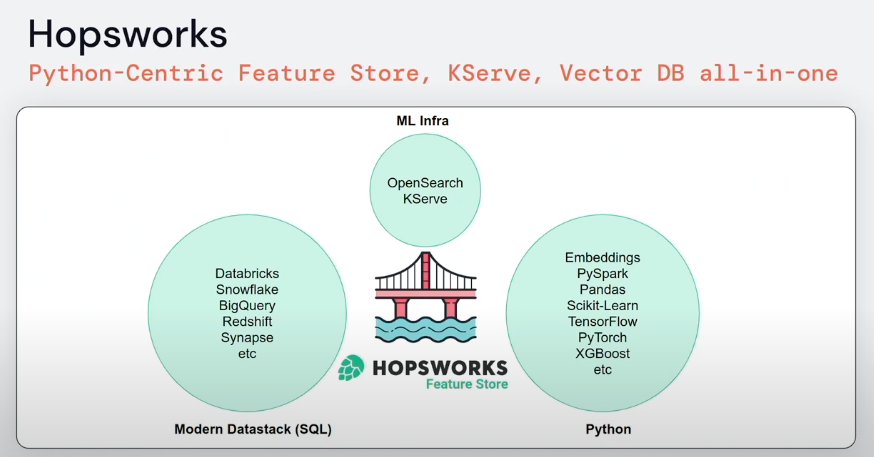

4) Most famous batch recommendations and how they work.

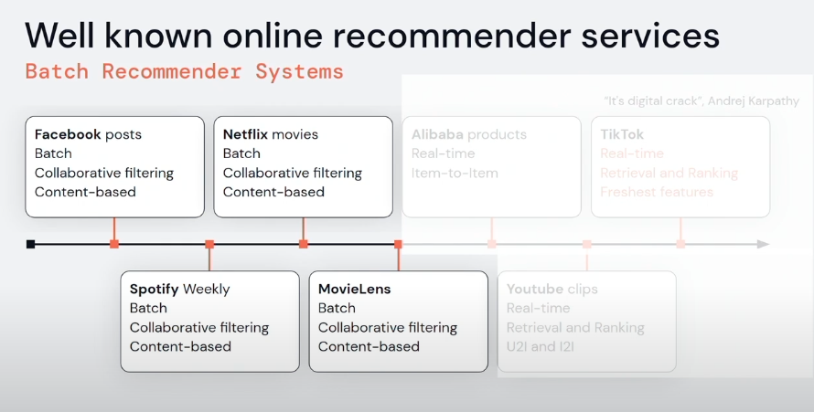

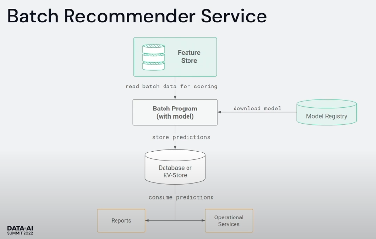

5) Most famous real time recommendations and how they work. Retrieval and ranking comes from youtube.

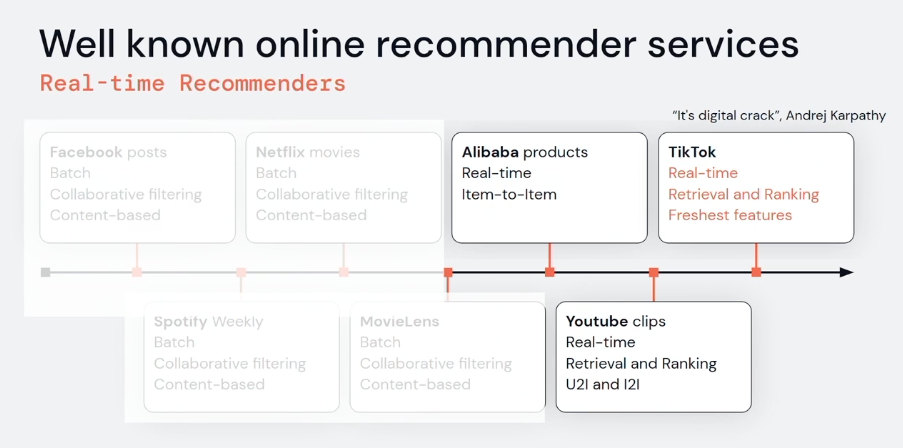

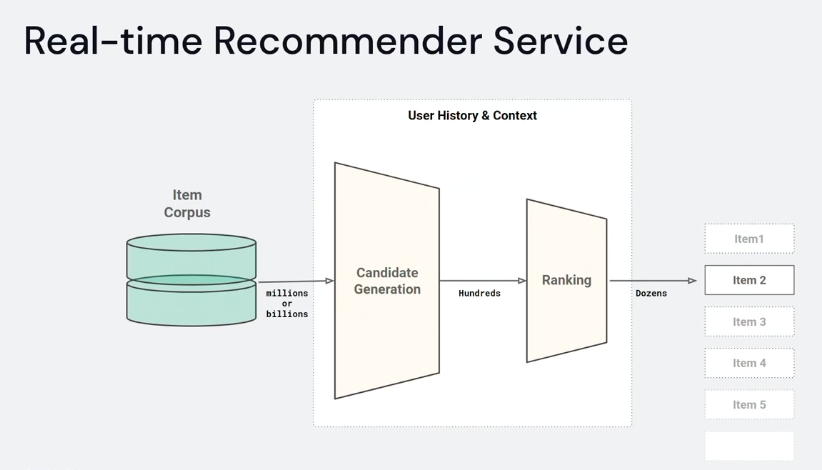

8) Train with two tower networks, Retrieve via Approximate nearest search, Filter based on business rules and rank all candidates.

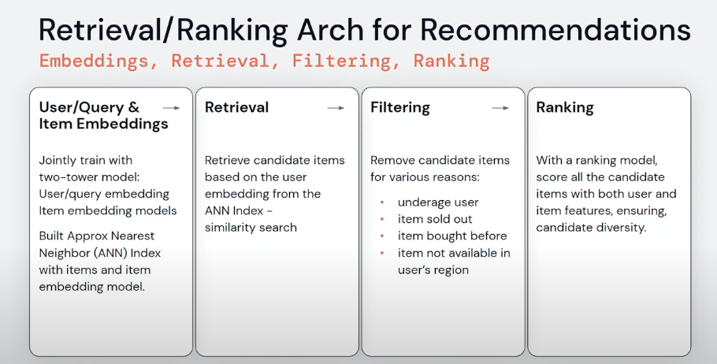

9) An article on system design for discovery: https://eugeneyan.com/writing/system-design-for-discovery/

10) Network architecture for two tower networks


11) Ranking model. Ranking model should predict fast because it will run in real time. Generally, tree based models are chosen.

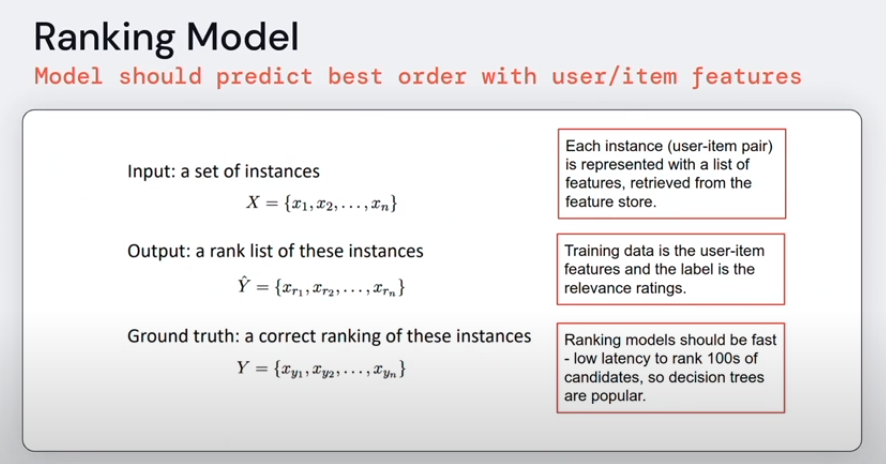

12) [Kserve](https://github.com/kserve/kserve) is defacto serving framework for kubernetes.

13) How retrieval and ranking works at inference. When a prediction is presented to the user, the feedback is created in order for labeling further training data.

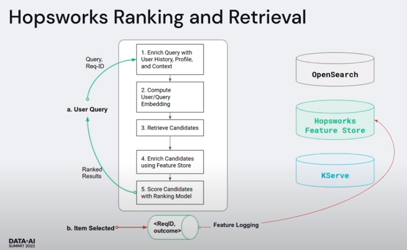

14) It requires low latency for feature store. Thus, in memory databases such as redis are used in feature stores behind the scenes. RonDB and Aerospike are used in spotify. RonDB with 6 nodes is able to handle 2 million operations per second.

15) User features such as age, gender are used for user input. Category of item and gender of item are used for item input. After integrating these with embedding layers of users and items, train the model with interactions of purchases. For evaluation on validation data, look at whether the predicted item is in the range of top closest 100 items.

16) After training, embeddings are computed. Then, embeddings are indexed on opensearch. On opensearch, faiss is an engine.


17) Used data for ranking

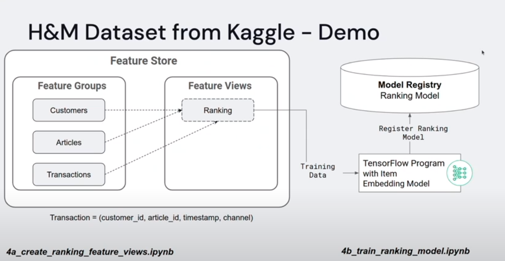

18) For ranking models, more metadata features can be integrated for better performance.

19) After creating positive data from input and user features, shuffle it to generate negative data. 10 negative samples for 1 positive sample is a good ratio.

20) Deployment architecture

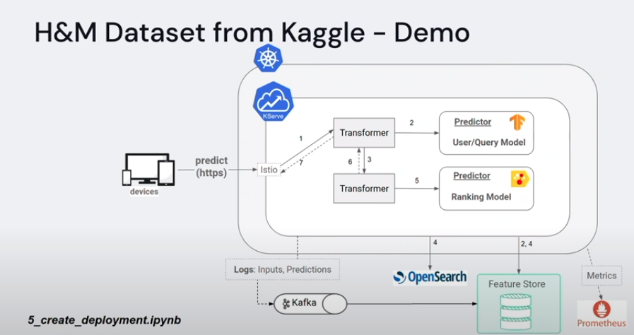


