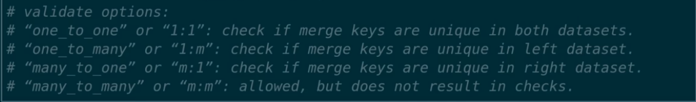

# Data-Science-Notes
Listing my Data Science Notes

1) We can access variables in pd.DataFrame().query() method like below

```
df = pd.DataFrame({'a':[1,2,3],'b':['x','y','z]})
BIGGER_FILTER = 2
df.query("a > @BIGGER_FILTER")
```

2) Usage of `.query()` can be encouraged. It is simple than complex filters.

3) For columns in the datetime format, use **parse_dates=['date_column_here']** in pd.read_csv().

4) Prefer dumping via to_parquet, to_feather, to_pickle instead of to_csv. It will preserver or data types and consume less spaces on hard disc.

5) We can use pd.DataFrame().style instead of MS Excel for formatting files.

6) validate option for pd.DataFrame().merge(validate=)



7) Converting string columns which are categorical to category type is a best practice. We can do this via `.astype('category')`

8) [Yellowbrick](https://github.com/DistrictDataLabs/yellowbrick) is a Python library that has useful visualizations for ML.


