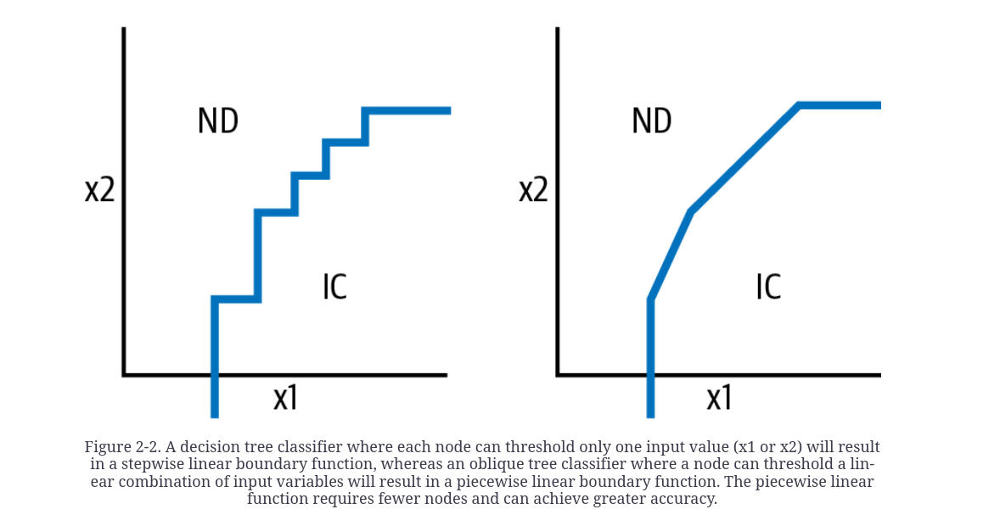
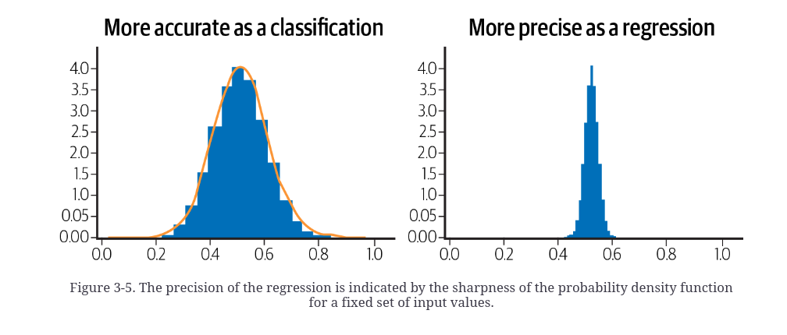
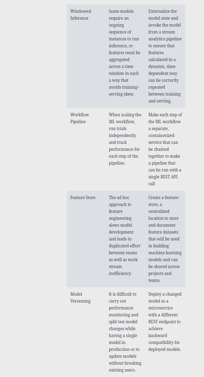

# Data-Science-Notes
Listing my Data Science Notes

1) We can access variables in pd.DataFrame().query() method like below

```
df = pd.DataFrame({'a':[1,2,3],'b':['x','y','z]})
BIGGER_FILTER = 2
df.query("a > @BIGGER_FILTER")
```

2) Usage of `.query()` can be encouraged. It is simple than complex filters.

3) For columns in the datetime format, use **parse_dates=['date_column_here']** in pd.read_csv().

4) Prefer dumping via to_parquet, to_feather, to_pickle instead of to_csv. It will preserver or data types and consume less spaces on hard disc.

5) We can use pd.DataFrame().style instead of MS Excel for formatting files.

6) validate option for pd.DataFrame().merge(validate=)


7) Converting string columns which are categorical to category type is a best practice. We can do this via `.astype('category')`

8) [Yellowbrick](https://github.com/DistrictDataLabs/yellowbrick) is a Python library that has useful visualizations for ML.

# Machine Learning Design Patterns

## The need for ML Design Patterns

1) ML models can be expressed in SQL using Google's BigQuery ML. It supports classification, regression and clustering.

2) Online prediction is useful if we care low latency. Batch prediction is useful if we don't care low latency.

3) Recommendation systems rely on batch predictions.

4) In Google's Big Query, Dataset is composed of many tables.

5) Data Quality can be checked in terms of accuracy, completeness, consistency and timel

## Data Representation Design Patterns

1) Input generally refers to non-processed data. When processed, it becomes feature.

2) Stepwise linear boundary function and Piecewise linear boundary function.



3) Optimizers generally work faster on [-1,1] range. Thus, it would be better to scale in that range. Linear Regression performed 9% faster when input is caled.

4) Scaling can be implemented after determining reasonable boundaries which exclude outliers.

5) When the distribution of the transformed input becomes normally distributed or uniform, it means transformation performed well.

6) Box-Cox Transformation is another way to deal with skewed data

```python

traindf['boxcox'], est_lambda = (
    scipy.stats.boxcox(traindf['num_views']))

# evaluation
evaldf['boxcox'] = scipy.stats.boxcox(evaldf['num_views'], est_lambda)

```

7) Modern ML algortihms don't require their inputs to be linearly independent. Modern ML algoritms use regularization such as L1 or L2 to prune redundant inputs.

8) Hashed Feature is a design pattern. Let's assume that we want to use departure airport in an ML model to predict whether the flight has a delay or not. However, in USA, there are 347 different airports. If we one-hot encode this, we will have 347 more columns, which consume a lot of memory and model spaces. Hence, it sounds reasonable to use a hash function to map these 347 values into some values. We can decide how many unique values in the transformed feature. Then, we can map input into features using a hash algorithm. This approach is durable to cold-start problem too. "A good rule of thumb is to choose the number of hash buckets such that each bucket gets about five entries".

9) Embedding is another design pattern. If we are creating an embedding layer, the size of embedding layer should be between fourth root of number of unique elements and 1.6\*square root of number of unique elements. Let's assume our vector has 625 unique elements. Our embedding vecor should be searched between 5(4th root of 625) and 40 (1.6*25).

10) [Feature columns](https://developers.googleblog.com/2017/11/introducing-tensorflow-feature-columns.html) is a detailed blog post by Tensorflow.

11) Feature cross means combining 2 or more categorical features into a single feature in order to capture the information between them. Complex models like Decision Trees and NN's can learn feature cross on their own. However, feature cross speeds up the learning. An example usage is to predict taxis fares by concatenating day of week(7) and hour of day(24). It will generate 168(7*24) new features. Hereby, we can capture some non-linearities. Always prefer concatenating non-correlated features.

12) We can use Feature cross and Embedding together.

13) Let's say we have a column named review whose possible values are [1,2,3,4,5]. 4 and 5 mean good reviews and 1,2,3 are bad review. Using raw form(1,2,3,4,5) and transformed form(good, bad) can contribute more to the model.

14) Embeddings and Bag of Words(BOW) are 2 different approaches to treat text. BOW doesn't take the order of the words into consideration.

## Problem Representation Design Patterns

### Reframing

1) Reframing means converting a regression problem to classificaiton or vice versa.

2) Quantile regression means predicting quantiles rather than real value. It is an implementation of reframing.

3) "A common rule of thumb for classification tasks is that we should have 10 times the number of model features for each label category. For a regression model, the rule of thumb is 50 times the number of model features".

4) Regression tasks require more data rather than classification tasks.

5) When to use regression and when to use classification



6) Hard Parameter sharing and Soft parameter sharing among NN's. Hard parameter sharing looks better compared to soft parameter sharing.


7) Multimodal distribution means the distribution has 2 peaks.


### Multilabel

8) Multilabel  can be xamplified in this way: One picture may have different animals and we want to predict whether the imge has a specific animal or not. In this design pattern, sigmod is used in the output layer rather than softmax. Softmax is used for multiclass classification.

9) The error of any ML model can be parsed into 3 parts: irreducible error, bias and variance.
Bias and variance are also called reducible error.

10) Stacking is an alternative to simply averaging different ML models. Stacking integrates an ML logic to combine predictions of base learners.

### Cascade

11) It is a design pattern meaning splitting the problem into sub-problems. Let's assume we want to predict if a transaction returns or not. However, resellers and retail buyers behave differently. Thus, we split the problem into the following steps:

- "Predicting whether a specific transaction is by a reseller

- Training one model on sales to retail buyers

- Training the second model on sales to resellers

- In production, combining the output of the three separate models to predict return likelihood for every item purchased and the probability that the transaction is by a reseller."

12) Another use case of Cascade Design Pattern is to use the output of first machine learning model as input of second machine learning model.

### Neutral Class

13) It is a design pattern that requires converting a binary classification problem into a 3-class multiclass classification. The new class is neutral class and it includes non-sure values.

14) It can be implemented in customer satisfaction models where a poll is having values between 1 and 10. Comments above 8 are regarded as good, comments below 5 are bad and the comments that lie between 5 and 8 are neutral.

### Rebalancing

1) "Machine learning models learn best when they are given a similar number of examples for each label class in a dataset".

2) Rebalancing means balancing classes. It can be carried in these ways:
    - Upsampling
    - Downsampling
    - Weighting

3) When we are evaluating our model, we shouldn't use upsampling. Let's assume we have a dataset whose 99 percent is 0 and 1 percent is 1. We upsampled the minority class to have a better training. We shouldn't evaulate our model on the upsampled data. We should have the original positive to negative ratio on evaluation data.

4) For an unbalanced data, it is more reasonable to use PR curve rather than AUC. For further details, take a look at [here](https://journals.plos.org/plosone/article?id=10.1371/journal.pone.0118432)

5) When training a NN, assigning a custom value like `bias = log(num_minority_examples / num_majority_examples) make NN converge faster.

6) We can label anomally values in the following way:

    - Fit a clustering model on input data
    - Predict new data on the fitted model
    - Measure the distance between predicted result and cluster centers.
    - If distance is high, label it as anomally.

7) We can combine Downsampling and Class weights approach. We can also combine Downsampling with Ensemble can be carried out via building 9 different models on the data whose 90 percent is 0 and 10 percent is 1.

## Model Training Patterns

## Useful Overfitting

1) "When building a machine learning model to learn such a physics model or dynamical system, there is no such thing as overfitting".

2) Overfitting is useful when there is no noise and labels are correct.

3) Overfitting on a batch of data is a reasonable way to check whether our code runs properly or not.

## Checkpoints

1) It is better to train more with regularization rather than an early-stopped model.

## Transfer Learning

1) [MLCommons](https://mlcommons.org/en/) is a website for Better Machine Learning
for Everyone.

2) [Tabnet](https://arxiv.org/pdf/1908.07442.pdf) is a work for transfer learning in tabular data.

3) Sentence embedding is actually a form of transfer learning.

4) When to use feature extraction and fine tuning in Transfer Learning


## Distribution Strategy

1) There are 2 ways to distribute NN's. These are data parallelism and model parallelism. Generally data parallelism preferred. Data parallelism means splitting data into multiple workers(on the same device or not). Model parallelism means splitting ML model into multiple workers. One ML model may not fit into a single memory. Google's NMT has billions of parameters. Thus, it is required to split the ML model into many pieces. Convolution layers are used in data parallelism and fully connected layers are used in model parallelism.

2) 2 types of training. Syncronous and Asyncronous. Syncronous training collects gradients from workers, averages them and obtains the new model with new weights and sends the new model to workers(GPU). One GPU might be bottleneck in this scenario. This is because we wait all workers to complete the mini-batch and send gradients back to parameter server.

3) Distribution strategies in Tensorflow


4) PyTorch uses DistributedDataParallel independent on one-multiple machines or one-multiple gpus.

5) Syncronous training


6) Asyncronous training


7) TPU's are ASIC's(application-specific integrated circuits). FPGA is Microsoft Azure's solution alternative to TPU's.

8) Snycronous and Asnycronous overlapping between CPU's and GPU's/TPU's


## Hyperparameter Tuning

1) "Hyperparameter tuning can be thought of as an outer optimization loop".

2) A common use case is to use the best value for each potential hyperparameters.

3) The goal of Bayesian optimization(BO) is to train as few as possible. BO defines a surrogate function that emulates our model but it is cheaper to run rather than model training.

4) BO evaluates the past model information to select hyperparameter values to build the newer model

5) Genetic algorithms are an alternative to bayesian optimization. However, genetic algorithms tend to require more training runs. Genetic algorithms are smarter than Random Search, Grid Search and Manual Search.

# Design Patterns for Resilient Serving

## Stateless Serving Function

1) It is important to minimize number of stateful parts of an application.

2) Allowing clients to send JSON requests with multiple instances in the request is called batching.

3) Packaging ML app and serving it via a creating a web endpoint(FaaS) abstracts the specifics of our ML model.

4) Stateless Serving is for low-latency serving.

## Batch Serving

1) Distributed data processing systems(MapReduce, Apache Spark, BigQuery, Apache Beam and so on) to carry out one-off predictions is not very efficient.

2) Recommendation engines use batch serving.

3) "[Lambda architecture](https://en.wikipedia.org/wiki/Lambda_architecture) is a data-processing architecture designed to handle massive quantities of data by taking advantage of both batch and stream-processing methods".

## Continued Model Evaluation

1) "The way people use credit cards has changed over time and thus the common characteristics of credit card fraud have also changed". This is concept drift.

2) "[Online machine learning](https://en.wikipedia.org/wiki/Online_machine_learning) is a method of machine learning in which data becomes available in a sequential order and is used to update the best predictor for future data at each step, as opposed to batch learning techniques which generate the best predictor by learning on the entire training data set at once".

3) A good way to learn retrain period is to predict new data using a former ML model and evaluate its performance. If error is bigger than expected, it requires more training.


## Two-Phase Predictions

1) Quantization is the process of lowering the size of ML model. Tensorflow lite is a library to carry out this operation.

2) An example is to use a voice assistance like Alexa. The ML model in the first phase is a small classifier to detect wake words(Hey, hello etc). The second is a bigger ML model used for complex tasks. The first model is on the edge device and the second model which is bigger will run in the cloud.

3) NVIDIA's Jetson Nano and and Google's Coral Edge TPU are 2 corporate edge devices.

## Keyed Predictions

1) It is reasonable to supply a unique key with each example when making prediction requests.

## Reproducibility Design Patterns

## Transform

## Repeatable Splitting

1) "In the case of time-series models, a common approach is to use sequential splits of data"

2) "Another instance where a sequential split of data is needed is when there are high correlations between successive times"

3) The more the dataset, the less need for stratification.

4) Some problems of low-performance ML models can be fixed via correcting data split.

5) Farm Fingerprint hashing algorithm is a way to split data into train, valid and test.

## Bridged Schema

1) Let's assume that we are trying to predict how much tip to be given. Before our development, there were 2 payment options(cash and card) but we added 2 more options(gift card and meal card). It raised from 2 to 4. However, we don't have these new 2 options by splitting card into gift card, meal card and credit card. After our development, some little data accumulated but it isn't sufficient. New data shows that tips coming via card are 60 percent credit card, 25 percent mal card and 15 percent meal card. In order to use these 2 new payment methods in our old data, we can do one of the below ways:
    - Probablistic method: Split former card payments into credit, meal and gift by its relative ratios on new data
    - Static Method(Preferrable): All former payments to be encoded as [0, 0.6, 0.25, 0.15].

2) Let's assume we have 2 datasets: old and new. Old data is 1000000 records and new data is 5000 records. We want to use some part of new data as evaluation set. However, we don't know how much to choose. In this scenario, we should run a loop like below to determine number of evaluation records. When standard deviation remains stable, the starting point of the stablity should be the exact number.

```determine_evaluation.py
for subset_size in range(100, 5000, 100):
    sizes.append(subset_size)
    # compute variability of the eval metric
    # at this subset size over 25 tries
    scores = []
    for x in range(1, 25):
        indices = np.random.choice(N_eval, 
                           size=subset_size, replace=False)
        scores.append(
            model.score(df_eval[indices], 
                        df_old.loc[N_train+indices, 'tip'])
        )
    score_mean.append(np.mean(scores))
    score_stddev.append(np.std(scores))
```


3) What about how many old data to select? In this situation, we should go for the same method. Select some subset of data and train the model and measure performance on evaluation set. When it starts to become a plateau, it might be the necessary training point.

4) Another way is to impute null values in old data using ML.

## Windowed Inference

## Workflow Pipeline

1) [Kubeflow pipeline- KFP](https://www.kubeflow.org/docs/components/pipelines/v1/introduction/) is an alternative to Apache Airflow. It is designed for ML.

## Feature Store

1) Feature store is "a centralized location to store and document feature datasets that will be used in building machine learning models and can be shared across projects and teams. The feature store acts as the interface between the data engineer’s pipelines for feature creation and the data scientist’s workflow building models using those features".

2) A feature store can use Redis or Cassandra for online serving and Hive and BigQuery for training.

3) [Feast](https://github.com/feast-dev/feast) is a feature store library. An example implementation is [here](https://github.com/GoogleCloudPlatform/ml-design-patterns/blob/master/06_reproducibility/feature_store.ipynb).


4) Feature Store decouples feature engineering from feature usage.

5) Uber's Michelangelo is another alternative Feature Store solution. "Uber’s Michelangelo Palette is built around Spark/Scala using Hive for offline feature creation and Cassandra for online features".

6) Some other solutions:

    - [Hopsworks](https://github.com/logicalclocks/hopsworks). It is open source. It is using  Spark and pandas with Hive for offline and MySQL Cluster for online feature access
    - Airbnb's Zipline

## Model Versioning

1) "To gracefully handle updates to a model, deploy multiple model versions with different REST endpoints"

2) An ML engineer might want to use an API Gateway like Apigee that determines which model version to run.

3) [Seldon](https://github.com/SeldonIO/seldon-core) is an open source platform to deploy your machine learning models on Kubernetes at massive scale.

# Responsible AI

## Heuristic Benchmark

1) "The Heuristic Benchmark pattern compares an ML model against a simple, easy-to-understand heuristic in order to explain the model’s performance to business decision makers"

2) The heuristic benchmark should be simple and understandable(mean, median, model). Don't use a heuristic benchmark if you have a running production model.

## Explainable Predictions

1) For interpratibility, a baseline for regression models is to use median values of input features like below

`[151.0, 93.5, 2803.5, 15.5, 76.0, 1.0, 0.0, 0.0]`.

2) SHAP is framework-agnostic and it works with image, text and tabular data.

3) Cloud Service Providers have AI explainability tools.

4) Integrated Gradients is another way for model interpratibility. It can be used with NN architectures. XRAI is another technique. IG is recommended for “non-natural” images like those taken in a medical, factory, or lab environment. XRAI usually works best for images taken in natural environment

5) [facets](https://github.com/PAIR-code/facets) and [pygwalker](https://github.com/Kanaries/pygwalker) is an alternative to Pandas Profiling. [What if Tool](https://pair-code.github.io/what-if-tool/) is another data inspection library.

6) [Lime](https://github.com/marcotcr/lime) and [eli5](https://github.com/eli5-org/eli5) are 2 libraries for ML explainability.

## Fairness Lens

1) "The Fairness Lens design pattern suggests the use of preprocessing and postprocessing techniques to ensure that model predictions are fair and equitable for different groups of users and scenarios"

2) Different types of biases

    - Reporting Bias: Vegeterian restaurant vs seafood restaurant
    - Implicit Bias: Zipcode and Gender etc.
    - Experimenter Bias: Labeller's annotation

3) "ML models are a direct representation of the data used to train them"

4) "It’s essential that our train, test, and validation splits maintain the same balance."

5) "Another approach to minimizing model bias is to perform data augmentation".

6) "Building on the ice cream example we used earlier in this section, the sentence “Mint chip is their best ice cream flavor” would become “BLANK is their best ice cream flavor” after applying ablation".

# Connected Patterns

1) The summary of design patterns




2) The interactions between design patterns


3) Reframing and Cascade design patterns can be combined. Convert regression problem to a classfication problem. Build up your classifier. Then output of this  classifier can be fed into the  second model, which is a Regression model. The splitting of one problem into 2 models is called Cascade design pattern.


