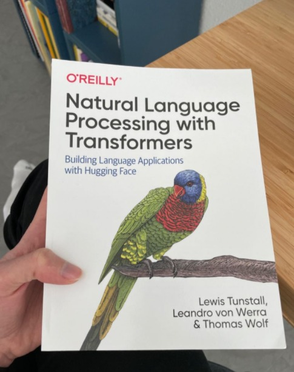

# Useful-Pictures-for-ML

1) RNN - MLP Similarity

2) RNN Visualization

3) Attention 1

4) Attention 2

5) Attention 3

6) Scalar Vector Matrix Tensor

7) Data Science WorkFlow

8) Difference between Machine Learning Algorithms

9) 17 equations

10) How LGB Works

11) XOR Problem Metaphor

12) AUC Intuition

13) stats.probplot

14) Embedding Layer

15) Covariance & Correlation

16) LDA Summary

17) Logistic Regression vs QDA

18) QDA Explanation

19) Curse of Dimensionality

20) Curse of Dimensionality 2

21) QDA vs QLR

22) AUC Calculation

23) Data Relaxation

24) Precision Recall AUC

25) Neural Network Null Imputation

26)Keras Embedding

27) Tabularization

28) Time Series Libraries(sktime not included)

29) A book on NLP transformers

30) Dimensionality reduction visualization

31) Priorities of SQL Operations

32) SQL Window Functions

33) Some important books to read

